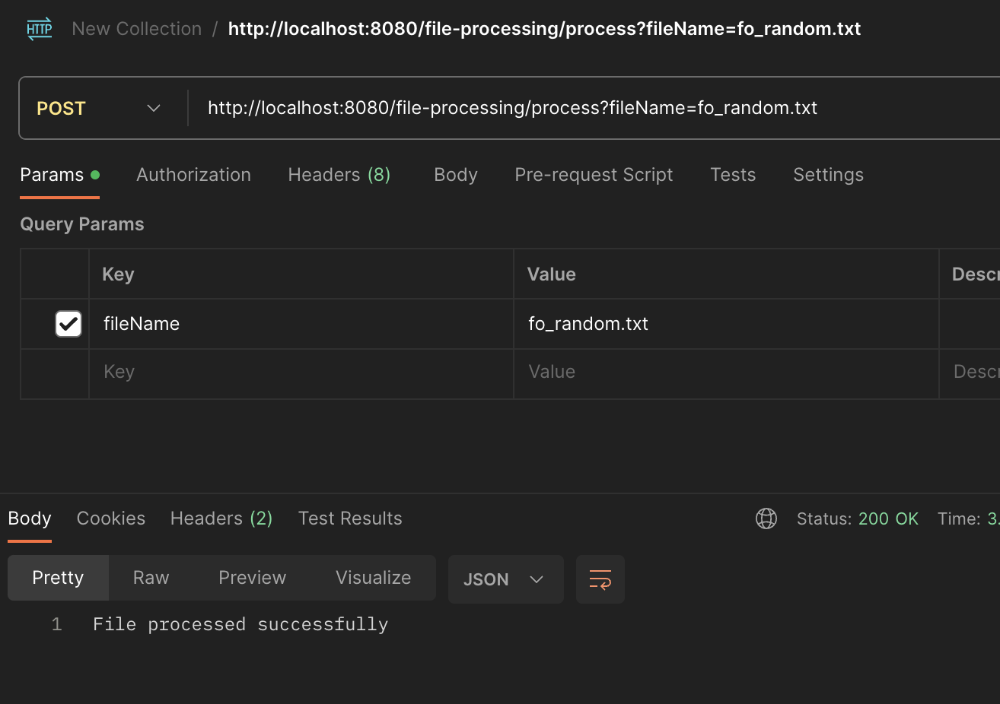
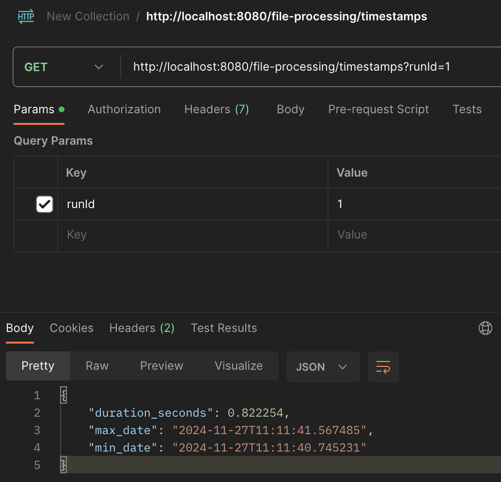

# File processing

This project uses **Quarkus**, the Supersonic Subatomic Java Framework.

If you want to learn more about Quarkus, please visit its website: <https://quarkus.io/>.

---

## Running the Application in Development Mode

You can run your application in development mode with live coding enabled using the following command:
```bash
./mvnw quarkus:dev
```

Available Endpoints
The project provides two REST API endpoints for processing files and retrieving timestamps. Below are the details:

### 1. Process File Endpoint

   

HTTP Method: POST
URL: /file-processing/process

Description: Processes a file and inserts match data into the database.

Query Parameter:
fileName (required): The name of the file to process.

Example Request:
```bash
curl -X POST "http://localhost:8080/file-processing/process?fileName=fo_random.txt" -H "Content-Type: application/json"
```

Example Response:
Success (200 OK):

_File processed successfully_


### 2. Get Timestamps Endpoint



HTTP Method: GET
URL: /file-processing/timestamps

Description: Retrieves the minimum and maximum timestamps for a given run ID, along with the duration in seconds between them.

Query Parameter:
runId (required): The ID of the run for which to retrieve timestamps.

Example Request:
```bash
curl -X GET "http://localhost:8080/file-processing/timestamps?runId=1" -H "Content-Type: application/json"
```

Example Response:
Success (200 OK):

_{
  "duration_seconds": 0.822254,
  "max_date": "2024-11-27T11:11:41.567485",
  "min_date": "2024-11-27T11:11:40.745231"
}_

